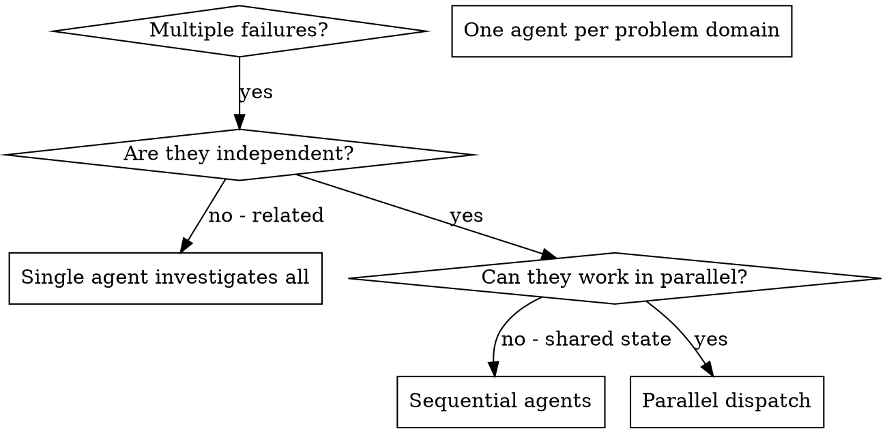

# Dispatching Parallel Agents

## Overview

You delegate tasks to specialized agents that run as their own sessions with their own context. By precisely crafting their instructions, you keep them focused and let them succeed at their task, while preserving your own context for coordination work.

**Context: construct it, and inherit only on purpose.** A subagent starts with nothing but the prompt you give it. That is the right default — an agent handed your whole history spends its budget re-reading your work instead of doing its own. But when a task genuinely depends on something you already established (a tool result the agent would otherwise have to re-derive, a decision made three turns ago), pass `fork_turns` and give it the last N of YOUR turns, verbatim tool calls and results included. `"none"` (the default) starts it clean; a number gives it that many of your most recent turns; `"all"` gives it everything, at real token cost. Reach for a small number, not `"all"` — and never as a substitute for writing a clear prompt.

When you have multiple unrelated failures (different test files, different subsystems, different bugs), investigating them sequentially wastes time. Each investigation is independent and can happen in parallel.

**Core principle:** Dispatch one agent per independent problem domain. Let them work concurrently.

## When to Use



**Use when:**
- 3+ test files failing with different root causes
- Multiple subsystems broken independently
- Each problem can be understood without context from others
- No shared state between investigations

**Don't use when:**
- Failures are related (fix one might fix others)
- Need to understand full system state
- Agents would interfere with each other

## The Pattern

### 1. Identify Independent Domains

Group failures by what's broken:
- File A tests: Tool approval flow
- File B tests: Batch completion behavior
- File C tests: Abort functionality

Each domain is independent - fixing tool approval doesn't affect abort tests.

### 2. Create Focused Agent Tasks

Each agent gets:
- **Specific scope:** One test file or subsystem
- **Clear goal:** Make these tests pass
- **Constraints:** Don't change other code
- **Expected output:** Summary of what you found and fixed

### 3. Dispatch in Parallel

`agent_spawn` starts an agent and returns immediately, so calling it three
times fans out three agents that run concurrently. It returns an `agentId`
and a `nickname` — use the nickname when you talk about the agent, the id
when you call a tool about it.

```
agent_spawn(prompt: "Fix agent-tool-abort.test.ts failures: ...")
  -> { agentId: "…", nickname: "Kepler" }
agent_spawn(prompt: "Fix batch-completion-behavior.test.ts failures: ...")
  -> { agentId: "…", nickname: "Faraday" }
agent_spawn(prompt: "Fix tool-approval-race-conditions.test.ts failures: ...")
  -> { agentId: "…", nickname: "Curie" }
```

All three run at once. Optional arguments:
- `agent` — the name of a configured subagent to run the task as; omit to
  delegate to a copy of yourself.
- `fork_turns` — how much of YOUR history to hand it (see Overview above).

**One blocking agent instead:** if you have nothing useful to do while it
works, `agent` does the same delegation but blocks and returns `{text}` (or
`{error}`) directly. Use it for a single delegated subtask; use `agent_spawn`
whenever you have two or more, or work of your own to get on with.

### 4. Collect Results

`agent_wait` blocks until at least one of your agents finishes and returns
those agents WITH their output (`result`, or `error` if the agent failed or
was stopped). It returns an empty list on timeout — that is not an error,
just call it again.

```
agent_wait()                                  -> waits on all of them
agent_wait(agent_ids: ["…"], timeout_ms: 120000) -> waits on specific ones
```

Loop until every agent is accounted for. The other tools:
- `agent_list` — every agent you started, with nickname and status. No output.
- `agent_result(agent_id)` — read a finished agent's output again later.
  `{ running: true }` means it has not finished.
- `agent_send(agent_id, message)` — steer an agent WHILE it is still running
  (a correction, an extra constraint). An agent has exactly one turn, so a
  message sent after it finishes is never read.
- `agent_stop(agent_id)` — abandon an agent: you stop waiting and its result
  is discarded. It does NOT interrupt the work, which keeps running (and
  costing) until it finishes on its own.

If your own turn ends while agents are still running, their results are
delivered to you as new messages when they finish. You do not have to sit in
`agent_wait` to receive them.

### 5. Review and Integrate

When agents return:
- Read each result
- Verify fixes don't conflict
- Run full test suite
- Integrate all changes

## Agent Prompt Structure

Good agent prompts are:
1. **Focused** - One clear problem domain
2. **Self-contained** - All context needed to understand the problem
3. **Specific about output** - What should the agent return?

```markdown
Fix the 3 failing tests in src/agents/agent-tool-abort.test.ts:

1. "should abort tool with partial output capture" - expects 'interrupted at' in message
2. "should handle mixed completed and aborted tools" - fast tool aborted instead of completed
3. "should properly track pendingToolCount" - expects 3 results but gets 0

These are timing/race condition issues. Your task:

1. Read the test file and understand what each test verifies
2. Identify root cause - timing issues or actual bugs?
3. Fix by:
   - Replacing arbitrary timeouts with event-based waiting
   - Fixing bugs in abort implementation if found
   - Adjusting test expectations if testing changed behavior

Do NOT just increase timeouts - find the real issue.

Return: Summary of what you found and what you fixed.
```

## Common Mistakes

**❌ Too broad:** "Fix all the tests" - agent gets lost
**✅ Specific:** "Fix agent-tool-abort.test.ts" - focused scope

**❌ No context:** "Fix the race condition" - agent doesn't know where
**✅ Context:** Paste the error messages and test names

**❌ No constraints:** Agent might refactor everything
**✅ Constraints:** "Do NOT change production code" or "Fix tests only"

**❌ Vague output:** "Fix it" - you don't know what changed
**✅ Specific:** "Return summary of root cause and changes"

## When NOT to Use

**Related failures:** Fixing one might fix others - investigate together first
**Need full context:** Understanding requires seeing entire system
**Exploratory debugging:** You don't know what's broken yet
**Shared state:** Agents would interfere (editing same files, using same resources)

## Real Example from Session

**Scenario:** 6 test failures across 3 files after major refactoring

**Failures:**
- agent-tool-abort.test.ts: 3 failures (timing issues)
- batch-completion-behavior.test.ts: 2 failures (tools not executing)
- tool-approval-race-conditions.test.ts: 1 failure (execution count = 0)

**Decision:** Independent domains - abort logic separate from batch completion separate from race conditions

**Dispatch:**
```
agent_spawn → Fix agent-tool-abort.test.ts
agent_spawn → Fix batch-completion-behavior.test.ts
agent_spawn → Fix tool-approval-race-conditions.test.ts
then agent_wait until all three report back
```

**Results:**
- Agent 1: Replaced timeouts with event-based waiting
- Agent 2: Fixed event structure bug (threadId in wrong place)
- Agent 3: Added wait for async tool execution to complete

**Integration:** All fixes independent, no conflicts, full suite green

**Time saved:** 3 problems solved in parallel vs sequentially

## Key Benefits

1. **Parallelization** - Multiple investigations happen simultaneously
2. **Focus** - Each agent has narrow scope, less context to track
3. **Independence** - Agents don't interfere with each other
4. **Speed** - 3 problems solved in time of 1

## Verification

After agents return:
1. **Review each summary** - Understand what changed
2. **Check for conflicts** - Did agents edit same code?
3. **Run full suite** - Verify all fixes work together
4. **Spot check** - Agents can make systematic errors

## Real-World Impact

From debugging session (2025-10-03):
- 6 failures across 3 files
- 3 agents dispatched in parallel
- All investigations completed concurrently
- All fixes integrated successfully
- Zero conflicts between agent changes
