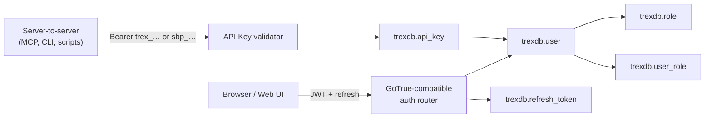
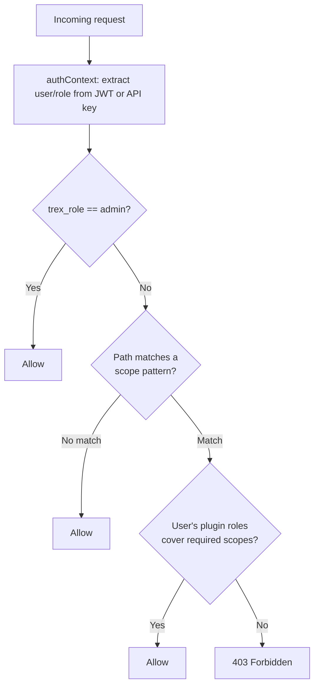
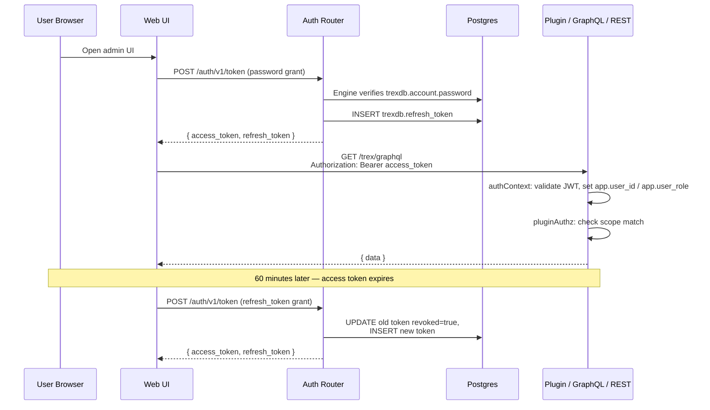

# Auth & Authorization

This page explains *how* Trex authenticates users and authorizes requests. For
the endpoint-by-endpoint reference, see [APIs → Auth](../apis/auth).

## The Engine and the Compatibility Surface

Two different things own authentication, and it is worth being precise about
which does what:

- **Better Auth is the engine.** It owns `trexdb.user`, `trexdb.session`,
  `trexdb.account` and `trexdb.verification`, and it is the only thing that
  verifies a password. A credential lives in `trexdb.account.password` for
  `providerId = 'credential'`; the engine hashes and verifies it with trex's own
  scrypt, through hooks installed in `core/server/auth/better-auth.ts`, so the
  hashes that existed before the cutover verify unchanged.
- **`/trex/auth/v1` is the compatibility surface.** It is a GoTrue-shaped
  router — `/token`, `/signup`, `/user`, `/change-password`, `/admin/users` —
  that reads and writes through the engine and then answers in Supabase's
  vocabulary.

Both exist because the clients and the engine disagree about the wire, not
about the model. Everything already pointed at trex — `supabase-js`, the web
UI, the CLI, the MCP server, every plugin — speaks GoTrue: a JWT access token,
an opaque rotating refresh token, `error`/`error_description` bodies. Better
Auth speaks none of that; it issues a session cookie and has no refresh-token
concept for this path. Replacing the wire would have meant changing every
caller at once. So the router kept its wire contract (pinned test-by-test in
`core/server/auth/auth-router.contract.test.ts`) and had its insides replaced:
credential verification, user reads and writes, and the admin block all go
through the engine now, and the JWT the caller receives is still minted by
`core/server/auth/jwt.ts`.

The practical consequence for an operator: the session cookie Better Auth sets
alongside the JWT is not decoration. It is what the OIDC provider
(`/trex/oidc/oauth2/authorize`, see [The OIDC Provider](#the-oidc-provider))
authenticates against, and it is signed with the `trex.better-auth.engine.v1`
subkey rather than the JWT signing key.

## Two Identity Surfaces

Trex carries two parallel identity surfaces, both backed by Postgres tables in
the `trexdb` schema:



- **Interactive sessions** issue short-lived JWT access tokens (1 hour) plus
  opaque refresh tokens. Browser-based UIs and the auth-required parts of the
  GraphQL/REST surface authenticate this way.
- **Machine-to-machine** clients (MCP, the `trex` CLI, automation scripts)
  present long-lived API keys. There are two prefixes — `trex_…` for
  server-issued keys and `sbp_…` for keys issued through the CLI device-code
  login. Both validate against `trexdb.api_key`.

The two surfaces share a single user table: every API key is owned by a user,
and that user's role determines what the key can do.

## What's in a JWT

When a user signs in with email + password (or refreshes a token), the auth
router signs a JWT with the following shape:

```json
{
  "sub": "<user-id>",
  "email": "alice@example.com",
  "role": "authenticated",
  "aud": "authenticated",
  "iss": "http://localhost:8000/trex/auth/v1",
  "iat": <unix timestamp>,
  "exp": <unix timestamp>,
  "session_id": "<uuid>",
  "app_metadata": {
    "provider": "email",
    "providers": ["email"],
    "trex_role": "admin"
  },
  "user_metadata": {
    "name": "Alice",
    "image": null,
    "must_change_password": false
  }
}
```

Note that the system role lives at `app_metadata.trex_role` — the top-level
`role` is always `authenticated` (Supabase/GoTrue compatibility); `iss` is
derived from `BETTER_AUTH_URL` + the base path.

The token is an HS256 JWT signed with a key derived from `TREX_ROOT_KEY` via
HKDF under the label `trex.jwt.hs256.v1` (see `core/server/auth/jwt.ts` and
`keys.ts`). `BETTER_AUTH_SECRET` is no longer the signing key — it survives
only as a legacy compatibility comment. To rotate the signing key, bump the
HKDF label suffix (e.g. `.v2`) and re-issue tokens; all tokens signed under the
old label become invalid by design. The token is consumed by the `authContext`
middleware, which extracts the `trex_role` and exposes it as the Postgres GUC
`app.user_role` for downstream queries.

## Roles & Scopes

Trex has *two* role concepts that look superficially similar but live in
different layers:

| Layer | Where | Purpose |
|-------|-------|---------|
| **System role** | `trexdb.user.role` (`admin` or `user`) | Determines whether the caller bypasses scope checks. |
| **Plugin roles** | `trexdb.role` (auto-created by plugins) + `trexdb.user_role` join | Fine-grained URL-pattern authorization for plugin routes. |

The system role is binary: admins bypass every authorization check. Non-admins
need plugin roles whose scope set covers the URL pattern they're hitting.
Plugin roles are assigned to users through the `trexdb.user_role` join table
(one row per `(userId, roleId)` pair).



A plugin contributes to this model by declaring `roles` and `scopes` in its
`package.json`. Scopes are URL patterns mapped to a list of required scope
strings; roles are named bundles of scope strings. The plugin loader
auto-creates rows in `trexdb.role` at startup so admins can assign them to
users (via `trexdb.user_role`) through the UI/MCP.

## Sessions & Refresh Tokens

Every interactive sign-in creates a session UUID and stores a refresh token in
`trexdb.refresh_token` keyed by that session. The session is the unit of
revocation: logging out, rotating a password, or revoking from
`/auth/v1/sessions` invalidates all refresh tokens tied to that session, but
leaves other sessions intact (so signing out of one device doesn't sign you out
everywhere).

Refresh tokens themselves are opaque random strings, hashed at rest. Rotation
is mandatory — using a refresh token marks it `revoked = true` and issues a new
one in the same session.

## The OIDC Provider

Trex is also an OpenID Connect provider. Everything above is how *trex* knows
who you are; this is how trex tells *another application* who you are — D2E's
WebAPI and Atlas3, and D2E's own portal, all sign in against it.

The provider is **`@better-auth/oauth-provider`**, a Better Auth plugin mounted
on the same engine instance as everything else (`core/server/auth/oidc/`).
There is no hand-rolled authorization server any more.

### Endpoints

| path | what it is |
|---|---|
| `/trex/oidc/.well-known/openid-configuration` | discovery document — **unmoved** |
| `/trex/oidc/.well-known/jwks.json` | signing keys — **unmoved** |
| `/trex/oidc/oauth2/authorize` | authorization endpoint |
| `/trex/oidc/oauth2/token` | token endpoint |
| `/trex/oidc/oauth2/userinfo` | UserInfo |
| `/trex/oidc/oauth2/end-session` | RP-initiated logout |
| `/trex/oidc/oauth2/introspect`, `/trex/oidc/oauth2/revoke` | served; trex ships no consumer for either |

Anything outside `/oauth2/` and `/.well-known/` under this mount is `404` — the
engine's own `/sign-in/email`, `/get-session` and the plugin's
`/admin/oauth2/*` client administration included. Credentials and sessions
belong to `/trex/auth/v1`, which has trex's error codes and trex's `requireAdmin`
in front of them.

**The four protocol endpoints moved, and they were not aliased back.** The
plugin hard-codes its own route paths and builds the discovery document from
them; neither is an option you can set. Serving the old paths would therefore
mean hand-writing a discovery document that disagreed with the routes the plugin
actually answers on — which is exactly the custom code the plugin was adopted to
delete. So the relying parties were reconfigured instead, and **anything still
calling `/trex/oidc/authorize`, `/trex/oidc/token` or `/trex/oidc/session/end`
gets a 404 the moment this version starts.** The issuer, the two `.well-known`
paths, `RS256` and the `roles` claim name are all unchanged, so a relying party
that reads its configuration from discovery needs no change at all.

D2E pins the served document byte-for-byte in CI
(`tests/golden/trex-oidc-discovery.json`), because endpoint or issuer drift
breaks WebAPI at startup and Atlas3 at sign-in with nothing in either log that
names the cause.

### Three fail-closed defaults

Each of these is silence rather than an error message, so they are worth
knowing before you meet one:

- **No refresh token unless `offline_access` was granted.** The plugin issues
  one only when that scope is in the granted set; trex's previous provider
  issued one unconditionally. A client whose `scopes` column omits it loses
  silent renewal, and nothing says so. `TREX_OIDC_CLIENT_SCOPES` therefore adds
  `openid` and `offline_access` to whatever you configure.
- **No `client_credentials` unless the client row has `clientCredentialsScopes`.**
  An empty list is how the plugin spells "this client may not use the grant",
  and the refusal names the scopes, not the grant.
- **No `/oauth2/end-session` unless the client row has `enable_end_session`.**
  A row written without it gets `invalid_client`, "The client is not allowed to
  initiate logout". The seeder sets it; a client registered by hand must too.

### One client row, one token-endpoint auth method

The seeded client (`TREX_OIDC_CLIENT_*`) is registered
**`client_secret_basic`** with **`requirePKCE: false`**. Both values are
forced by the same relying party: Spring Security — WebAPI's OIDC client, and
therefore Atlas3's, since Atlas3 reaches the provider only *through* WebAPI —
sends no `code_challenge` at all and presents its secret in an `Authorization`
header. Against a row demanding PKCE every WebAPI sign-in is refused at
`/authorize`; against a `client_secret_post` row the exchange is a bare `401`.

`requirePKCE: false` restores trex's posture from before the cutover, where a
challenge was demanded of public clients only. **It does not stop a supplied
challenge being checked.** `/authorize` still rejects a malformed or non-S256
challenge and still binds a well-formed one to the code, and `/oauth2/token`
still refuses the exchange when a challenge was used and the verifier is wrong
(`401`, "code verification failed") or missing. The column decides only whether
a challenge is *demanded*. So D2E's portal, which does send PKCE, keeps its
stolen-code protection in full, and public clients
(`tokenEndpointAuthMethod: "none"`) are still held to PKCE regardless of the
column.

**The consequence to plan around: one row can answer for exactly one
token-endpoint authentication method.** A request that presents its credentials
the other way is refused outright — "client registered for client_secret_basic
cannot use client_secret_post". A future relying party that can only do
`client_secret_post` needs a **second client row**, not a change to this one.

### Rate limits

Two independent budgets sit in front of the provider.

1. **Better Auth's own limiter**, `TREX_OIDC_RATE_LIMIT_MAX` (default 600 per
   900 s), applied per path to `/oauth2/{token,authorize,userinfo,introspect,revoke}`.
   The plugin's own defaults — 20/60 s on `/token`, 30/60 s on `/authorize` —
   are deliberately replaced; they would cap a whole deployment at roughly
   twenty sign-ins a minute.
2. **A failure-keyed budget in front of `/oauth2/userinfo`**,
   `TREX_OIDC_USERINFO_FAILURE_MAX` (default 60 per 900 s), charged only when
   the endpoint *refuses* a caller. It exists because `/oauth2/userinfo` is on
   the critical path of every WebAPI sign-in, and Better Auth's limiter keys on
   `<ip>|<path>` with no hook to change the key — so without it, a flood of
   rejected requests and a real sign-in share one counter and the flood denies
   sign-in to everybody. A refusal never reaches Better Auth's counter, and a
   successful call is never charged. `5xx` is not charged either: nobody is
   locked out for trex's own outage.

**These are per client IP only because trex normalises `X-Forwarded-For` on the
way in.** Better Auth resolves the client address from headers alone, and its
`isValidIP` rejects a `host:port` token — which is exactly what Caddy's
`{remote}` placeholder produces. Every caller then lands in one bucket. Trex
strips the port in `oidc/mount.ts` before the engine reads the header (`[v6]:port`
and a `v4:port` with exactly one colon; a bare IPv6 address is left alone,
because `2001:db8::1` and `2001:db8::1:443` cannot be told apart), and D2E's
gateway now sends `{remote_host}`. Set `TREX_TRUSTED_PROXIES` if your own
gateway appends to a multi-token header.

Where no client address can be resolved at all, the budgets are shared — which
is why the *failure* budget exists: the shared bucket an attacker can exhaust is
then the one no legitimate sign-in draws on.

### What the provider does not give you

- **`/oauth2/userinfo` emits no `roles`.** It returns exactly
  `{sub, name, email, email_verified, trex_role}`. The id_token and the access
  token both carry `roles` (and `app_metadata`); the UserInfo document does not,
  and did not before the cutover either. Anything resolving roles from UserInfo
  alone sees none. WebAPI is fine because Spring merges the id_token's claims
  with UserInfo's into one `OidcUser`.
- **`backchannel_logout_supported: true` is advertised and cannot be delivered.**
  The plugin implements Back-Channel Logout properly — it signs a Logout Token
  per affected client on session deletion and POSTs it to that client's
  registered `backchannel_logout_uri` — but only for a client that *has* one,
  and no trex client can: the seeder writes no such URI and reads no environment
  variable for one, dynamic client registration is off, and client
  administration over HTTP is refused. The flag cannot be turned off either: the
  plugin derives it from `!disableJwtPlugin`, and disabling the JWT plugin would
  drop `jwks_uri` and move signing off `RS256`. **Treat the flag as false, and
  do not build a relying party that waits for a Logout Token.**
- **RP-initiated logout with an `id_token_hint` does not complete on a
  `localhost` stack.** The cause is a bug in the plugin: `verifyLogoutHint`
  fetches its own JWKS over HTTP from the *public* issuer
  (`dist/authorize-riRRCSbC.mjs:547`), where its two sibling call sites pass a
  local function and never leave the process. On a stack whose public name is
  `localhost`, that request cannot leave the container — glibc special-cases the
  name (RFC 6761), so no `extra_hosts` entry can point it at the gateway — and
  the hint is judged invalid. The failure is made **visible** rather than
  silent: trex re-verifies the hint against its own key set and, when the hint
  is genuine, adds an `X-Trex-Logout-Hint: rejected; local-verification=…`
  header and a banner to the confirmation page. On a **real FQDN** the name
  resolves and the only remaining risk is certificate trust, which
  `TLS__EXTRA__CA_CRTS` fixes by carrying the gateway's root into the trex
  image's trust store. Do **not** try to fix this with the jwt plugin's
  `jwks.remoteUrl`: setting it publishes that internal address as `jwks_uri` to
  every relying party *and* makes trex's own JWKS route answer `404`, breaking
  sign-in to fix logout.

## SSO

The `/auth/v1/settings` endpoint reports which SSO providers are enabled. For
each provider, settings come from one of two sources:

1. **`trexdb.sso_provider`** (DB-driven) — preferred. Allows runtime
   configuration, supports Apple, and tracks per-provider client IDs.
2. **Environment variables** (`GOOGLE_CLIENT_ID`, etc.) — legacy fallback for
   bootstrap.

A row is advertised only when it is `enabled` **and** carries an `issuer`. A row
with no issuer is configuration in progress, not a provider: it would put a
button on the login page whose `/authorize` answers "Unknown provider". That is
why the MCP `sso-save` tool cannot create a working provider — it writes five
columns and `issuer` is not one of them — and why it says so when it has just
produced such a row. Use `PUT /admin/federation/providers/:id`.

The OIDC dance itself is `@better-auth/sso`'s. trex keeps `/auth/v1/authorize`
and `/auth/v1/callback` at the paths every upstream has registered and forwards
them to the plugin, and keeps the policy the plugin has none of: the
per-provider enable switch, per-provider auto-provision, the domain allowlist,
the elevated-account guard, group resolution and the placeholder-address rule
below.

### What the cutover to `@better-auth/sso` gave up

Recorded here because none of it is visible from a diff, and each one is a
capability a deployment could be relying on today.

- **`claim_map.sub` no longer does anything.** `oidcConfig.mapping` can remap
  `email`, `emailVerified`, `name` and `extraFields`; it cannot remap the
  subject. An upstream that calls the subject something other than `sub` —
  Entra's `oid` is the case this was written for — is no longer supportable
  through configuration. For a provider whose `claim_map` maps `sub`, every
  already-linked user would present a different `accountId` than its stored row
  holds and would fall through to the email path. No row on any reachable
  installation maps it, and the admin API cannot write one (`ProviderUpsert` has
  no `claim_map` field), so the repair is a migration rewriting
  `trexdb.account."accountId"` for that provider — not a code change.
- **The OIDC `nonce` is gone.** The plugin sends none and checks none. PKCE S256
  is on per provider and the `state` is single-use, database-backed and bound to
  a signed browser cookie, which is what `nonce` defends in the
  authorization-code flow (where OIDC Core makes it OPTIONAL).
- **The id_token's signing algorithm is no longer pinned to what the provider
  advertises.** A downgrade to `none` or to an HMAC is still unavailable — there
  is no symmetric key in a JWKS to resolve to — but a discovery document
  advertising only `RS256` no longer stops an `ES256`-signed token from an EC key
  in the same JWKS.
- **`TREX_FEDERATION_REDIRECT_URI` is now required when federating.** The plugin
  takes one fixed `redirect_uri` at construction; trex used to derive it from the
  request when the variable was unset. A federating deployment that leaves it
  unset fails at the upstream with an unregistered `redirect_uri`.
- **Every upstream's issuer origin must be in `BETTER_AUTH_TRUSTED_ORIGINS`**, as
  must its token, UserInfo and JWKS origins. Boot audits the ones the provider
  row can name and says which are missing.
- **A stored address in mixed case is no longer matched** by the first-time link
  lookup. trex's own SQL asked `lower(email) = lower($1)`; Better Auth's adapter
  cannot express that, so the incoming address is lower-cased and compared
  exactly — the same lookup the engine itself makes next. It is fail-closed: a
  miss refuses or provisions, never links to the wrong row, and V16's unique
  index on `lower(email)` plus V17's backfill mean such a row can only predate
  them.
- **Auto-provision now requires `claim_map.email` to name a real address claim.**
  The engine writes `mapping.email`'s value into `user.email`, which on a
  username-only upstream is a username. Rather than let an unaddressable row be
  created, a first-time identity is refused unless the value the engine will
  store is the address the policy just judged. Pre-linked identities never reach
  this branch, so no migrated user is affected.

What did **not** change: a refusal with no `TREX_OIDC_LOGIN_URL` configured is
still the JSON `403`, not a redirect to somewhere nothing is served.

### Placeholder Addresses

Better Auth requires an address on every user, but an upstream identity
provider is free to assert none — and plenty do, for service accounts and for
directory entries that were never mailboxes. Those users get a synthesised
address of the form `<slug>@d2e.local`, where the slug comes from the
identifier they actually sign in with (the upstream subject), and the row is
marked `is_placeholder_email = true`.

**A placeholder is an internal identifier, not a contact address.** Nobody
asserted it and nothing resolves it. Two rules follow:

- **Nothing may mail it.** trex sends no mail today, so this is a constraint on
  whatever is added next — a password-reset mail, a notification plugin, an
  export that feeds a mailing list. Branch on `is_placeholder_email`, not on the
  domain, and skip the row. And branch on it rather than assuming the domain is
  unreachable: `d2e.local` is d2e's own internal service domain
  (`TLS__INTERNAL__DOMAIN`), chosen here because it is what d2e's migration
  mints, not because it is reserved. Mail sent there goes somewhere.
- **Federated sign-in never matches a candidate user on one.** Enforced in
  `core/server/auth/federation/resolve-user.ts`'s `findCandidate`: an upstream
  asserting `<someone else's subject>@d2e.local` as a verified address would
  otherwise be handed that person's account. The predicate is on the row's
  `is_placeholder_email` column, not on the domain, so `PUT /user` clearing the
  flag makes the account linkable again.

**Two ways a row becomes a placeholder, and they must look identical.**

1. **trex synthesised it**, because the identity asserted no address. `V17`
   backfilled the rows that existed at the cutover; the federation provisioning
   path mints the ones that arrive afterwards, under the same domain and the
   same slug rule.
2. **A caller supplied an address already in `d2e.local`.** A migration that has
   no address to give for a user sends `<username>@<its configured domain>`
   rather than nothing — the federation admin link requires an address — and at
   the default domain that string is exactly a placeholder. Such a row is
   flagged the same way, keyed on the domain alone and not on who asked or what
   the local part looks like.

   This holds for five of the six routes that write a login address: the
   federation admin link, federated auto-provision, `POST /admin/users`, MCP
   `user-create` and `PUT /user` (which derives the flag from the new address on
   every update rather than clearing it). **`POST /signup` is the exception, on
   purpose:** an account somebody registers for themselves — the bootstrap
   administrator among them — should not be written `emailVerified = false`, and
   it is the one route where the flag costs nothing anyway, because
   `user_email_lower_key` stops a registration taking an address a row already
   holds and the placeholder slug falls back to `<id>@d2e.local` when one is
   taken, so such an address cannot be used to reach anybody else's row.

   **The exception rests on both of those facts and dies with either** — add a
   mail path that reads the column, or relax the unique index, and `/signup`
   has to join the other five. It also does not claim squatting is harmless:
   registering an address before its owner arrives puts their federated identity
   inside the squatter's account. That is `decideLink`'s posture on every
   domain, with `emailDomainAllowlist` as the intended control, so `d2e.local`
   is neither more nor less exposed than any other.

The second case is not hypothetical: it is how 66 of 69 users looked in a
migration rehearsal, and before the domain rule they were written
`is_placeholder_email = false`, `emailVerified = true`, with
`email_confirmed_at` set — which is the flag telling a mail path the exact
opposite of the truth, and, because federated sign-in excludes only *flagged*
rows, leaving every one of them claimable by another upstream asserting its
address.

`PUT /user` clears the flag when a real address is set.

**What a placeholder costs at the OIDC provider: nothing, measured.** Such a row
carries `emailVerified = false`, and the `email_verified` claim tracks that
column faithfully in the id_token, the access token and `/oauth2/userinfo`
alike. The migration rehearsal that produced the 66-of-69 figure above left that
open as a risk to the relying parties; the cutover rehearsal closed it. Every
sign-in in it ran with `emailVerified = false` — WebAPI authenticated, Atlas3
loaded and redeemed its token, the portal's own API calls answered 200 — so
**neither WebAPI nor Atlas3 reads the claim.** That is a measurement of these
relying parties, not a guarantee about one that was not in the stack.

## API Keys for MCP & CLI

API keys give code paths the same authorization story as user sessions, with
two simplifications:

- They never expire on a clock — they're explicitly revoked.
- They carry their owner's `trex_role`. An API key issued by an admin user
  authorizes admin-level operations; one from a regular user does not.

Trex issues two prefixes:

- `trex_<48-hex>` — created via the web UI or the `api-key-create` MCP tool.
  Targeted at MCP and other internal automation.
- `sbp_…` — created by the CLI device-code login flow. Compatible with
  `SUPABASE_ACCESS_TOKEN`-style auth; the management API accepts both prefixes
  interchangeably.

## Putting It Together



## Next steps

- See [APIs → Auth](../apis/auth) for endpoint-by-endpoint reference.
- See [Plugins → Function Plugins](../plugins/function-plugins) for how a
  plugin declares its own roles and scopes.
- See [APIs → MCP](../apis/mcp) and [CLI](../cli) for how the two API-key
  prefixes are used in practice.
