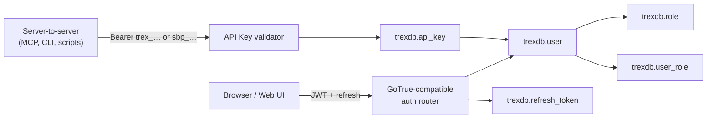
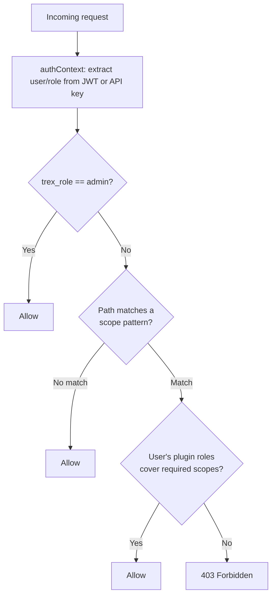
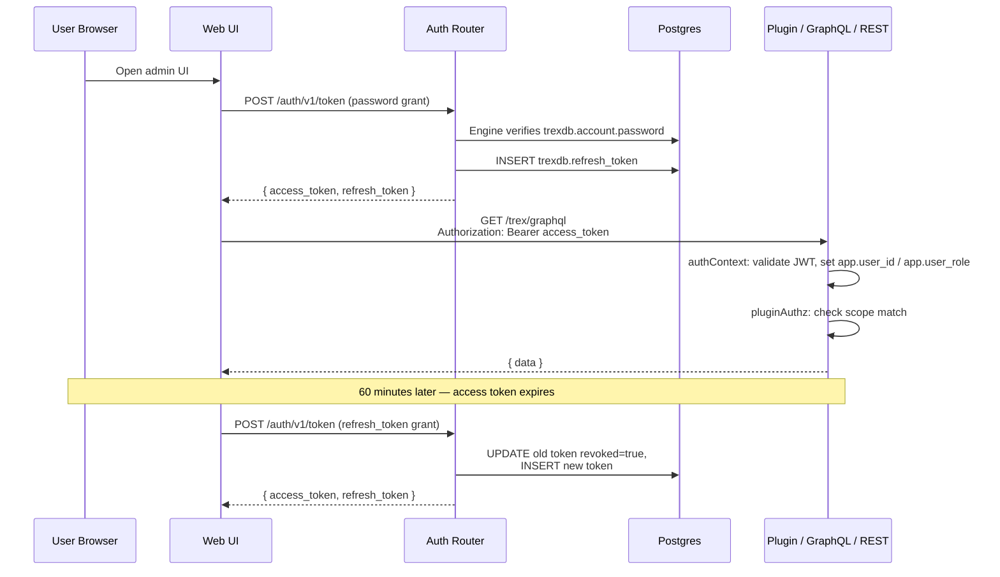

# Auth & Authorization

This page explains *how* Trex authenticates users and authorizes requests. For
the endpoint-by-endpoint reference, see [APIs → Auth](../apis/auth).

## The Engine and the Compatibility Surface

Two different things own authentication, and it is worth being precise about
which does what:

- **Better Auth is the engine.** It owns `trexdb.user`, `trexdb.session`,
  `trexdb.account` and `trexdb.verification`, and it is the only thing that
  verifies a password. A credential lives in `trexdb.account.password` for
  `providerId = 'credential'`; the engine hashes and verifies it with trex's own
  scrypt, through hooks installed in `core/server/auth/better-auth.ts`, so the
  hashes that existed before the cutover verify unchanged.
- **`/trex/auth/v1` is the compatibility surface.** It is a GoTrue-shaped
  router — `/token`, `/signup`, `/user`, `/change-password`, `/admin/users` —
  that reads and writes through the engine and then answers in Supabase's
  vocabulary.

Both exist because the clients and the engine disagree about the wire, not
about the model. Everything already pointed at trex — `supabase-js`, the web
UI, the CLI, the MCP server, every plugin — speaks GoTrue: a JWT access token,
an opaque rotating refresh token, `error`/`error_description` bodies. Better
Auth speaks none of that; it issues a session cookie and has no refresh-token
concept for this path. Replacing the wire would have meant changing every
caller at once. So the router kept its wire contract (pinned test-by-test in
`core/server/auth/auth-router.contract.test.ts`) and had its insides replaced:
credential verification, user reads and writes, and the admin block all go
through the engine now, and the JWT the caller receives is still minted by
`core/server/auth/jwt.ts`.

The practical consequence for an operator: the session cookie Better Auth sets
alongside the JWT is not decoration. It is what the OIDC provider
(`/trex/auth/v1/oauth2/authorize`) authenticates against, and it is signed with
the `trex.better-auth.engine.v1` subkey rather than the JWT signing key.

## Two Identity Surfaces

Trex carries two parallel identity surfaces, both backed by Postgres tables in
the `trexdb` schema:



- **Interactive sessions** issue short-lived JWT access tokens (1 hour) plus
  opaque refresh tokens. Browser-based UIs and the auth-required parts of the
  GraphQL/REST surface authenticate this way.
- **Machine-to-machine** clients (MCP, the `trex` CLI, automation scripts)
  present long-lived API keys. There are two prefixes — `trex_…` for
  server-issued keys and `sbp_…` for keys issued through the CLI device-code
  login. Both validate against `trexdb.api_key`.

The two surfaces share a single user table: every API key is owned by a user,
and that user's role determines what the key can do.

## What's in a JWT

When a user signs in with email + password (or refreshes a token), the auth
router signs a JWT with the following shape:

```json
{
  "sub": "<user-id>",
  "email": "alice@example.com",
  "role": "authenticated",
  "aud": "authenticated",
  "iss": "http://localhost:8000/trex/auth/v1",
  "iat": <unix timestamp>,
  "exp": <unix timestamp>,
  "session_id": "<uuid>",
  "app_metadata": {
    "provider": "email",
    "providers": ["email"],
    "trex_role": "admin"
  },
  "user_metadata": {
    "name": "Alice",
    "image": null,
    "must_change_password": false
  }
}
```

Note that the system role lives at `app_metadata.trex_role` — the top-level
`role` is always `authenticated` (Supabase/GoTrue compatibility); `iss` is
derived from `BETTER_AUTH_URL` + the base path.

The token is an HS256 JWT signed with a key derived from `TREX_ROOT_KEY` via
HKDF under the label `trex.jwt.hs256.v1` (see `core/server/auth/jwt.ts` and
`keys.ts`). `BETTER_AUTH_SECRET` is no longer the signing key — it survives
only as a legacy compatibility comment. To rotate the signing key, bump the
HKDF label suffix (e.g. `.v2`) and re-issue tokens; all tokens signed under the
old label become invalid by design. The token is consumed by the `authContext`
middleware, which extracts the `trex_role` and exposes it as the Postgres GUC
`app.user_role` for downstream queries.

## Roles & Scopes

Trex has *two* role concepts that look superficially similar but live in
different layers:

| Layer | Where | Purpose |
|-------|-------|---------|
| **System role** | `trexdb.user.role` (`admin` or `user`) | Determines whether the caller bypasses scope checks. |
| **Plugin roles** | `trexdb.role` (auto-created by plugins) + `trexdb.user_role` join | Fine-grained URL-pattern authorization for plugin routes. |

The system role is binary: admins bypass every authorization check. Non-admins
need plugin roles whose scope set covers the URL pattern they're hitting.
Plugin roles are assigned to users through the `trexdb.user_role` join table
(one row per `(userId, roleId)` pair).



A plugin contributes to this model by declaring `roles` and `scopes` in its
`package.json`. Scopes are URL patterns mapped to a list of required scope
strings; roles are named bundles of scope strings. The plugin loader
auto-creates rows in `trexdb.role` at startup so admins can assign them to
users (via `trexdb.user_role`) through the UI/MCP.

## Sessions & Refresh Tokens

Every interactive sign-in creates a session UUID and stores a refresh token in
`trexdb.refresh_token` keyed by that session. The session is the unit of
revocation: logging out, rotating a password, or revoking from
`/auth/v1/sessions` invalidates all refresh tokens tied to that session, but
leaves other sessions intact (so signing out of one device doesn't sign you out
everywhere).

Refresh tokens themselves are opaque random strings, hashed at rest. Rotation
is mandatory — using a refresh token marks it `revoked = true` and issues a new
one in the same session.

## SSO

The `/auth/v1/settings` endpoint reports which SSO providers are enabled. For
each provider, settings come from one of two sources:

1. **`trexdb.sso_provider`** (DB-driven) — preferred. Allows runtime
   configuration, supports Apple, and tracks per-provider client IDs.
2. **Environment variables** (`GOOGLE_CLIENT_ID`, etc.) — legacy fallback for
   bootstrap.

Enabled providers appear in the login page. The actual OAuth dance is driven
by the auth router's social provider plumbing.

### Placeholder Addresses

Better Auth requires an address on every user, but an upstream identity
provider is free to assert none — and plenty do, for service accounts and for
directory entries that were never mailboxes. Those users get a synthesised
address of the form `<slug>@d2e.local`, where the slug comes from the
identifier they actually sign in with (the upstream subject), and the row is
marked `is_placeholder_email = true`.

**A placeholder is an internal identifier, not a contact address.** Nobody
asserted it and nothing resolves it. Two rules follow:

- **Nothing may mail it.** trex sends no mail today, so this is a constraint on
  whatever is added next — a password-reset mail, a notification plugin, an
  export that feeds a mailing list. Branch on `is_placeholder_email`, not on the
  domain, and skip the row. And branch on it rather than assuming the domain is
  unreachable: `d2e.local` is d2e's own internal service domain
  (`TLS__INTERNAL__DOMAIN`), chosen here because it is what d2e's migration
  mints, not because it is reserved. Mail sent there goes somewhere.
- **Federated sign-in never matches a candidate user on one.** Enforced in
  `core/server/auth/federation/providers.ts`: an upstream asserting
  `<someone else's subject>@d2e.local` as a verified address would otherwise be
  handed that person's account.

**Two ways a row becomes a placeholder, and they must look identical.**

1. **trex synthesised it**, because the identity asserted no address. `V17`
   backfilled the rows that existed at the cutover; the federation provisioning
   path mints the ones that arrive afterwards, under the same domain and the
   same slug rule.
2. **A caller supplied an address already in `d2e.local`.** A migration that has
   no address to give for a user sends `<username>@<its configured domain>`
   rather than nothing — the federation admin link requires an address — and at
   the default domain that string is exactly a placeholder. Such a row is
   flagged the same way, keyed on the domain alone and not on who asked or what
   the local part looks like.

   This holds for five of the six routes that write a login address: the
   federation admin link, federated auto-provision, `POST /admin/users`, MCP
   `user-create` and `PUT /user` (which derives the flag from the new address on
   every update rather than clearing it). **`POST /signup` is the exception, on
   purpose:** an account somebody registers for themselves — the bootstrap
   administrator among them — should not be written `emailVerified = false`, and
   it is the one route where the flag costs nothing anyway, because
   `user_email_lower_key` stops a registration taking an address a row already
   holds and the placeholder slug falls back to `<id>@d2e.local` when one is
   taken, so such an address cannot be used to reach anybody else's row.

   **The exception rests on both of those facts and dies with either** — add a
   mail path that reads the column, or relax the unique index, and `/signup`
   has to join the other five. It also does not claim squatting is harmless:
   registering an address before its owner arrives puts their federated identity
   inside the squatter's account. That is `decideLink`'s posture on every
   domain, with `emailDomainAllowlist` as the intended control, so `d2e.local`
   is neither more nor less exposed than any other.

The second case is not hypothetical: it is how 66 of 69 users looked in a
migration rehearsal, and before the domain rule they were written
`is_placeholder_email = false`, `emailVerified = true`, with
`email_confirmed_at` set — which is the flag telling a mail path the exact
opposite of the truth, and, because federated sign-in excludes only *flagged*
rows, leaving every one of them claimable by another upstream asserting its
address.

`PUT /user` clears the flag when a real address is set.

## API Keys for MCP & CLI

API keys give code paths the same authorization story as user sessions, with
two simplifications:

- They never expire on a clock — they're explicitly revoked.
- They carry their owner's `trex_role`. An API key issued by an admin user
  authorizes admin-level operations; one from a regular user does not.

Trex issues two prefixes:

- `trex_<48-hex>` — created via the web UI or the `api-key-create` MCP tool.
  Targeted at MCP and other internal automation.
- `sbp_…` — created by the CLI device-code login flow. Compatible with
  `SUPABASE_ACCESS_TOKEN`-style auth; the management API accepts both prefixes
  interchangeably.

## Putting It Together



## Next steps

- See [APIs → Auth](../apis/auth) for endpoint-by-endpoint reference.
- See [Plugins → Function Plugins](../plugins/function-plugins) for how a
  plugin declares its own roles and scopes.
- See [APIs → MCP](../apis/mcp) and [CLI](../cli) for how the two API-key
  prefixes are used in practice.
