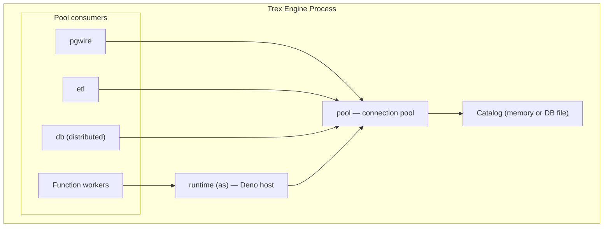

# Connection Pool & Runtime

Two "infrastructure" extensions are loaded transparently every time Trex
starts: `pool` and `runtime` (which loads under the core name `as`). Neither
exposes user-facing SQL functions. They're worth understanding because they
shape what you observe when running heavy workloads, debugging session-local
state, or tuning concurrency.

## The two layers

| Extension | What it is |
|-----------|------------|
| **pool** | A loadable DuckDB/C-API extension exposing a shared connection pool — a fixed set of cloned engine connections fronted by a serialized write queue. Other extensions (`pgwire`, `runtime`/`as`, `db`, `etl`) lease connections from the pool instead of opening direct engine connections. The consumer-side bindings live in a separate `pool-client` (`trex-pool-client`) Rust crate. |
| **runtime** (`as`) | A Deno-based runtime hosted inside the engine process. Powers the edge-function workers and acts as the bridge between Express HTTP handlers and engine queries. Sits on top of `pool`. |

The pool is initialized at startup with a fixed number of connections. The
size defaults to 1024 but is configurable via the `TREX_POOL_SIZE` environment
variable (`plugins/pool/src/lib.rs`). Every incoming pgwire connection, every
transform query, and every CDC pipeline leases a connection from the pool,
executes, and returns it. Leases that aren't returned within a timeout
(`TREX_POOL_LEASE_TIMEOUT_MS`, default 30s) surface an error pointing you at
`TREX_POOL_SIZE` or a leaked session.

## Sessions and session-local state

A pool *session* leases one cloned engine connection for the lifetime of the
caller (a pgwire connection, an edge-function invocation, a CDC pipeline). For
the duration of that session the same underlying connection serves every
statement, so connection-local state — temp tables, `PREPARE`/`DECLARE`,
`ATTACH`, `SET`, `USE`, loaded extensions — behaves exactly as it would on a
plain Postgres connection.

To keep this cheap, the pool tracks a per-session **dirty** flag. A coarse
substring check (`sql_may_dirty_session` in `plugins/pool/src/lib.rs`) marks a
session dirty whenever a statement *might* leave non-replayable state behind
(`TEMP`, `PREPARE`, `DECLARE`, `ATTACH`, `SET `, `USE `, `INSTALL`, `LOAD`, …).
Only dirty sessions pay for the expensive catalog-cleanup pass when they're
returned to the pool; the common read/`BEGIN`/`INSERT`/`COMMIT` hot path skips
it. Writes across the pool are funneled through a serialized write queue so
that concurrent sessions don't corrupt shared catalog state.

This is invisible to the client. `psql` and JDBC see a normal Postgres session
with normal session semantics. The reason it's worth knowing: if you're
benchmarking pool sizing or debugging "why does my temp table disappear?", the
answer is in this session/dirty-cleanup model — and a session that is never
released (a leaked lease) permanently removes one connection from the pool.

### Default catalog

When the pool initializes, every connection in the pool inherits the engine's
default catalog. With the default compose stack that's `memory` (in-RAM); set
`DATABASE_PATH=/data/trex.db` to use a persistent file. Clients can switch
catalogs with `USE <db>` or `SET search_path` mid-session — those are
stateful, so they mark the session dirty (see above) and persist for the rest
of that session.

## Why `runtime` exists

The Trex Deno runtime is more than a stock Deno — it embeds a connection
listener that lets edge functions invoke each other (and core server code)
through an in-process bus, bypassing the HTTP loopback. When the core server
calls a plugin function, it doesn't make an HTTP request to itself; it queues
a message on the bus, which `runtime` dispatches to the right Deno worker.

This matters in two contexts:

- **Edge functions accessing the engine**: a function calling `trex_query()`
  leases from the same `pool`, so a function that runs an `ATTACH` keeps that
  state for the lifetime of that worker invocation's session.
- **Inter-plugin calls**: the MCP `plugin-function-invoke` tool and certain
  GraphQL operations route through this bus.

## What you might tune

- **`TREX_POOL_SIZE`** — number of connections in the pool (default 1024). Raise
  it if many concurrent sessions hold long leases.
- **`TREX_PG_CONNECTION_LIMIT`** — cap on real Postgres connections the DuckDB
  postgres extension opens per attached catalog (default 1024, extension default
  64). Must be `>=` `TREX_POOL_SIZE` and `<=` the Postgres server's `max_connections`,
  or sessions touching `_config.*` fail with "PostgresConnectionPool maximum
  connection count exceeded".
- **`TREX_POOL_LEASE_TIMEOUT_MS`** — how long a caller waits for a free
  connection before erroring out (default 30000). The error message points back
  at `TREX_POOL_SIZE` or a leaked/long-held session.

If you hit a wall on concurrency, check `trex_db_query_status()` for the
queued/running breakdown — admission control bites before pool exhaustion in
most realistic workloads.

## Next steps

- [SQL Reference → pgwire](../sql-reference/pgwire) covers the pool/pinning
  story from the client side, plus the supported wire types.
- [SQL Reference → etl](../sql-reference/etl) is a primary pool consumer for
  CDC pipelines.
- [Concepts → Query Pipeline](query-pipeline) shows where the pool sits in the
  end-to-end request path.
