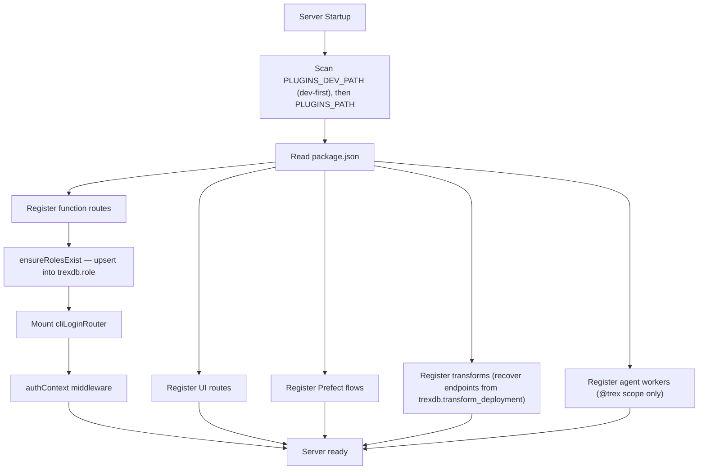

# Plugin System Overview

trexsql has a plugin system that extends the management application with custom API endpoints, UI pages, and workflow definitions. Plugins are standard NPM packages with a `trex` configuration block in `package.json`. Plugin-owned schema migrations are handled directly by the [`migration` extension](../sql-reference/migration).

## Plugin Types

| Type | Purpose | Key |
|------|---------|-----|
| **Function** | HTTP API endpoints via Deno workers | `trex.functions` |
| **UI** | Static frontend assets and navigation items | `trex.ui` |
| **Flow** | Prefect workflow deployments | `trex.flow` |
| **Transform** | Data transformation projects with model endpoints | `trex.transform` |
| **Agent** | AI agents running on the eve-compatible agents runtime | `trex.agents` |

A single plugin can combine multiple types.

## Plugin Lifecycle



## Plugin Discovery

Plugins are scanned from two directories at server startup:

- **`PLUGINS_PATH`** (default: `./plugins`) — production plugins
- **`PLUGINS_DEV_PATH`** (default: `./plugins-dev`) — development plugins, always scanned (no `NODE_ENV` check)

The dev path is scanned first (dev-first, higher priority), then the production path. The scanner walks each directory, enters scoped packages (those starting with `@`), and reads `package.json` from each subdirectory. The short name is derived from the package name (e.g., `@trex/my-plugin` becomes `my-plugin`). The URL scope segment is derived from the package **scope**, not the short name — `@trex/...` yields a `/trex` segment.

## Plugin Installation

Plugins can be installed via SQL using the [tpm extension](../sql-reference/tpm):

```sql
SELECT * FROM trex_plugin_install_with_deps('@trex/my-plugin@1.0.0', './plugins');
```

Or through the MCP API and admin UI.

## Authorization

Plugins can define custom roles and scopes for fine-grained access control:

```json
{
  "trex": {
    "functions": {
      "roles": {
        "my-plugin-admin": ["my-plugin:read", "my-plugin:write"]
      },
      "scopes": [
        { "path": "/plugins/my-plugin/admin/*", "scopes": ["my-plugin:write"] }
      ]
    }
  }
}
```

- Roles are auto-created in the `trexdb.role` database table at startup
- Admin users bypass all scope checks
- Plugin routes are protected by auth context and authorization middleware
