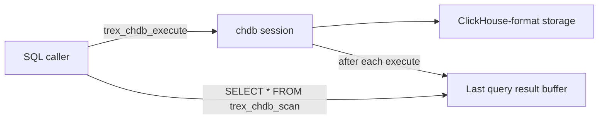

# chdb — Embedded ClickHouse

The `chdb` extension embeds [chDB](https://github.com/chdb-io/chdb)
(ClickHouse-as-a-library) inside the Trex process. It runs ClickHouse SQL
against a ClickHouse-format catalog and surfaces results back as Trex tables
— so you can mix ClickHouse-native features (Materialized Views,
`ReplacingMergeTree`, ClickHouse-flavored windowing, the very deep
analytics function library) into Trex queries without standing up a separate
ClickHouse server.

## When to use it

- You have ClickHouse skills / queries / SQL snippets and want to keep them
  on a Trex deployment.
- You need a ClickHouse-specific feature DuckDB doesn't have — `Distributed`
  tables, `ReplicatedMergeTree`, ClickHouse JSON ops, etc.
- You're migrating from ClickHouse to Trex incrementally and want to keep
  read-only queries working during the transition.

If you only need to *query* an existing ClickHouse cluster, you don't need
this extension — use a ClickHouse JDBC client against the upstream cluster
directly. `chdb` is for embedding ClickHouse *into* Trex.

## How it works



`chdb` runs as an in-process session. You start it with `trex_chdb_start`,
execute ClickHouse SQL with `trex_chdb_execute`, and read results back via
`trex_chdb_scan` (or its alias `trex_chdb_query`). The result buffer holds
**only** the most recent query — there is no streaming or cursor model.
Capture results into a Trex table (`CREATE TABLE … AS SELECT * FROM
trex_chdb_scan()`) if you need to keep them.

:::warning Fixed working directory
In the current implementation, `trex_chdb_execute` and `trex_chdb_scan`
always operate against a fixed on-disk working directory, `/tmp/chdb_dml`,
regardless of any path you pass to `trex_chdb_start`. See
[Persistence](#persistence) below for the details.
:::

## Typical workflow

```sql
-- 1. Start chdb (once per node). Note: execute/scan operate against the
--    fixed /tmp/chdb_dml working dir regardless of the path given here.
SELECT trex_chdb_start('/data/chdb');

-- 2. Define a ClickHouse table
SELECT trex_chdb_execute(
  'CREATE TABLE events (
     ts DateTime,
     user_id UInt64,
     event String
   ) ENGINE = MergeTree ORDER BY (user_id, ts)'
);

-- 3. Bulk-load (e.g. from a Trex query)
COPY (SELECT * FROM memory.main.events_source)
  TO '/tmp/events.parquet' (FORMAT PARQUET);

SELECT trex_chdb_execute(
  'INSERT INTO events SELECT * FROM file(''/tmp/events.parquet'', ''Parquet'')'
);

-- 4. Run a ClickHouse-flavored aggregation
SELECT trex_chdb_execute(
  'SELECT user_id, count() AS n, anyLast(event) AS last_event
     FROM events
    GROUP BY user_id
    ORDER BY n DESC LIMIT 10'
);

-- 5. Pull results back into the Trex query plan
SELECT * FROM trex_chdb_scan();
```

## Functions

### `trex_chdb_start()`

Initialize the chDB session. With no argument, the session is created
without an explicit data path.

```sql
SELECT trex_chdb_start();
```

### `trex_chdb_start(path)`

Initialize the chDB session and record `path` as the global session's data
directory.

```sql
SELECT trex_chdb_start('/data/chdb');
```

:::caution Path not yet honored by execute/scan
The `path` you pass here is stored on the global session, but
`trex_chdb_execute` and `trex_chdb_scan` do **not** use it — they always
open their own session at the fixed directory `/tmp/chdb_dml`. As a result,
data written by `execute` and read by `scan` lives under `/tmp/chdb_dml`
irrespective of the start path. See [Persistence](#persistence).
:::

### `trex_chdb_stop()`

Returns the status string `"Database stopped"`. In the current
implementation this is effectively a no-op: it does **not** tear down the
global session, close anything, or delete on-disk data. Data under
`/tmp/chdb_dml` persists across `stop`/`start` cycles and process restarts
until you remove the directory yourself.

```sql
SELECT trex_chdb_stop();
```

### `trex_chdb_execute(query)`

Execute any ClickHouse SQL — DDL, DML, or SELECT. The result of a SELECT
is buffered for retrieval via `trex_chdb_scan()`. DDL/DML returns a status
string.

```sql
SELECT trex_chdb_execute('CREATE TABLE t (id UInt32) ENGINE = MergeTree ORDER BY id');
SELECT trex_chdb_execute('INSERT INTO t VALUES (1), (2), (3)');
SELECT trex_chdb_execute('SELECT * FROM t');
SELECT * FROM trex_chdb_scan();   -- → 1, 2, 3
```

The buffer is overwritten on every execute, so chain `execute` and `scan`
without intervening calls if you need both halves.

### `trex_chdb_scan()` / `trex_chdb_query()`

Read the most recent query result as a Trex table. Columns are inferred
from the ClickHouse result schema. The two names are aliases.

```sql
SELECT * FROM trex_chdb_scan();
```

## Persistence

The persistence model is simpler — and more fixed — than the `start(path)`
signature suggests:

- **`execute` and `scan` always use `/tmp/chdb_dml`.** Both
  `trex_chdb_execute` and `trex_chdb_scan` open their own chDB session
  against the hardcoded on-disk directory `/tmp/chdb_dml`. They do this
  regardless of whether you called `trex_chdb_start` at all, and regardless
  of the path you passed to it. There is no in-memory / ephemeral mode for
  these functions — they always hit disk.
- **The start path is recorded but unused by execute/scan.** A path passed
  to `trex_chdb_start(path)` is stored on the global session object, but the
  execute/scan code paths do not read it. This is the current behavior; the
  start path is not yet honored.
- **`stop` does not free data.** `trex_chdb_stop()` returns a status string
  without tearing down the session or deleting `/tmp/chdb_dml`. To reclaim
  the space, remove the directory at the OS level.

If you need a clean slate between runs, delete `/tmp/chdb_dml` yourself
before starting.

## Operational notes

- **Memory pressure.** chDB allocates separately from the Trex engine; large
  MergeTree tables count against process RSS, not Trex's normal
  memory accounting.
- **No CDC into chdb.** The `etl` extension replicates Postgres → Trex
  catalog. If you want continuous data into chDB tables, write a transform
  plugin or use ClickHouse's own table functions (e.g. `postgresql()`).
- **x86_64 builds only (packaging constraint).** The bundled chDB native
  library is fetched per-platform by `install_chdb.sh`, which has packages
  for linux x86_64 / linux aarch64 / macOS x86_64. There is no `target_arch`
  guard in the extension source; availability is a function of which
  `libchdb` package the build pulls in for your platform.

## Next steps

- [SQL Reference → etl](etl) — replicate Postgres into Trex (and from there
  optionally pivot into chDB tables).
- [Concepts → Query Pipeline](../concepts/query-pipeline) — how `chdb`
  scans interact with the rest of a query plan.
