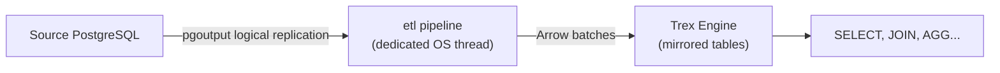

# etl — PostgreSQL CDC Replication

The `etl` extension continuously replicates a Postgres database into the Trex
analytical engine. It reads Postgres' logical replication stream, converts each
INSERT/UPDATE/DELETE into Arrow batches, and applies them to mirrored Trex
tables in real time.

Use it when you want analytical queries over operational data **without** going
back to the OLTP Postgres on every read. A federated `ATTACH` (see
[hana](hana) / Postgres scanner) hits the source on each query; a CDC pipeline
maintains a local materialized copy that can serve queries from columnar
storage at sub-second latency.

## How it works



Each pipeline runs on a dedicated OS thread with its own single-threaded
tokio runtime. That thread drives the replication state machine and writes
into the engine through `trex_pool_client` sessions — there is no external
scheduler or task queue involved. It uses Postgres' built-in logical
replication, so the source needs:

- `wal_level = logical` in `postgresql.conf`.
- A `REPLICATION` privilege for the connection user.
- A publication declaring which tables to replicate (`CREATE PUBLICATION
  trex_pub FOR TABLE …`). You name this publication in the connection string
  (`publication=trex_pub`); the pipeline does not create it for you.

## Replication modes

| Mode | What it does | When to use |
|------|--------------|-------------|
| `copy_and_cdc` | Bulk-copy current table contents, then switch to CDC streaming with no gap. **Default.** | Standing replication / initial bootstrap of a long-lived pipeline. |
| `cdc_only` | Skip the initial copy; tail the logical replication stream for INSERT/UPDATE/DELETE only. | Resuming or attaching to an already-loaded target. |
| `copy_only` | Bulk-copy current table contents once. | One-shot loads, dev/test. |

`copy_and_cdc` is the mode used when you call `trex_etl_start` without an
explicit mode argument.

## Typical workflow

```sql
-- 1. On the source Postgres (one-time setup):
--      ALTER SYSTEM SET wal_level = logical;       -- requires restart
--      CREATE PUBLICATION trex_pub FOR ALL TABLES;
--      CREATE ROLE trex_repl WITH REPLICATION LOGIN PASSWORD '...';

-- 2. In Trex, start the pipeline. The connection string is a libpq
--    keyword string and must include publication= for cdc modes:
SELECT trex_etl_start(
  'orders_pipeline',
  'host=source-db port=5432 dbname=app user=trex_repl password=pass publication=trex_pub schema=public',
  'copy_and_cdc',
  1000,    -- batch size
  5000,    -- batch timeout (ms)
  10000,   -- retry delay (ms)
  5        -- max retries
);

-- 3. Verify it's running:
SELECT * FROM trex_etl_status();

-- 4. Query mirrored data:
SELECT customer_id, COUNT(*)
  FROM orders
 GROUP BY customer_id;

-- 5. Stop when done (e.g. before draining the source):
SELECT trex_etl_stop('orders_pipeline');
```

## Functions

### Connection string format

The `connection_string` is a **libpq keyword/value string**, not a
`postgres://` URL. Supported keys:

| Key | Required | Default | Description |
|-----|----------|---------|-------------|
| `host` | no | `localhost` | Source Postgres host. |
| `port` | no | `5432` | Source Postgres port. |
| `dbname` | no | `postgres` | Source database name. |
| `user` | no | `postgres` | Connection user (needs `REPLICATION`). |
| `password` | no | — | Connection password. |
| `publication` | **yes for `copy_and_cdc` / `cdc_only`** | — | Name of the Postgres publication to read. Optional for `copy_only`. |
| `schema` | no | `public` | Source schema to replicate. |

```
host=source-db port=5432 dbname=app user=trex_repl password=pass publication=trex_pub schema=public
```

Omitting `publication=` in a cdc mode fails with
`connection string must include 'publication=<name>'`.

### `trex_etl_start(name, connection_string, ...)`

Start a replication pipeline. Picked by argument count:

**Minimal** (2 args) — defaults to `copy_and_cdc` mode and default params
(batch size 1000, 5s timeout, 10s retry, 5 retries):

```sql
SELECT trex_etl_start(
  'my_pipeline',
  'host=host port=5432 dbname=db user=u password=p publication=trex_pub'
);
```

**With mode** (3 args):

```sql
SELECT trex_etl_start('my_pipeline', 'host=… publication=trex_pub', 'cdc_only');
```

**Legacy params, no mode** (6 args) — defaults to `copy_and_cdc` mode,
params from the four trailing integers:

```sql
SELECT trex_etl_start('my_pipeline', 'host=… publication=trex_pub', 1000, 5000, 10000, 5);
```

**Full configuration** (7 args) — mode plus params:

```sql
SELECT trex_etl_start(
  'my_pipeline',
  'host=host port=5432 dbname=db user=u password=p publication=trex_pub',
  'copy_and_cdc',
  1000, 5000, 10000, 5
);
```

| Parameter | Type | Default | Description |
|-----------|------|---------|-------------|
| name | VARCHAR | — | Pipeline name. Registry key; also the `__etl_<name>` ATTACH alias used internally (dashes become underscores). |
| connection_string | VARCHAR | — | libpq keyword string (see above). |
| mode | VARCHAR | `copy_and_cdc` | `copy_and_cdc`, `cdc_only`, or `copy_only`. |
| batch_size | INTEGER | 1000 | Rows per Arrow batch flushed to the engine. |
| batch_timeout | INTEGER | 5000 | Maximum ms to wait before flushing a partial batch. |
| retry_delay | INTEGER | 10000 | Delay (ms) between retry attempts on connection failure. |
| retry_max | INTEGER | 5 | Maximum retry attempts before the pipeline goes to `error` state. |

Tuning: bigger `batch_size` improves throughput but increases peak memory and
end-to-end latency. `batch_timeout` is the *maximum* a row sits in the buffer
before being applied — set it to your latency target.

### `trex_etl_stop(name)`

Stop a running pipeline, identified by its registry `name`.

```sql
SELECT trex_etl_stop('my_pipeline');
```

### `trex_etl_status()`

Show every pipeline known to this node.

**Returns:** TABLE

| Column | Description |
|--------|-------------|
| name | Pipeline name. |
| state | One of `starting`, `snapshotting`, `streaming`, `stopping`, `stopped`, `error`. |
| mode | The mode the pipeline was started with. |
| connection | Connection string (password redacted). |
| publication | The Postgres publication being read. |
| snapshot | The boolean `snapshot_enabled`, rendered as `"true"`/`"false"` — i.e. whether this mode performs the initial copy (`true` for `copy_and_cdc` / `copy_only`). Not an LSN. |
| rows_replicated | Cumulative count since pipeline start. |
| last_activity | Last time a batch was flushed (epoch seconds). |
| error | Last error string if state is `error`. |

```sql
SELECT name, state, rows_replicated, last_activity, error
  FROM trex_etl_status();
```

## Operational notes

- **Replication slots accumulate WAL on the source** until the pipeline reads
  them. A stopped or stuck pipeline can fill the source's disk — set up
  alerting on `pg_replication_slots.confirmed_flush_lsn` lag.
- **Schema changes are not replicated.** The pipeline reads data, not DDL. If
  you `ALTER TABLE` on the source, restart the pipeline (in a copy mode such
  as `copy_and_cdc`) so Trex re-reads the table structure on the next copy.
- **Each pipeline name is unique.** The name is the key in the in-memory
  pipeline registry; starting a second pipeline with a name already in use is
  rejected.
- **Dedicated thread, not a shared scheduler.** Each pipeline runs on its own
  OS thread with a private tokio runtime, writing into the engine via
  `trex_pool_client` sessions. A single Trex node can host many pipelines this
  way; there is no external orchestrator. (The separate `plugins/bao` is a
  Clojure datamart application, unrelated to ETL scheduling.)

## Next steps

- [SQL Reference → db](db) — distributing replicated tables across cluster
  nodes via `trex_db_partition_table`.
- [Quickstart: Federate a Postgres database](../quickstarts/federate-postgres)
  — when you don't need replication and a live federated query suffices.
